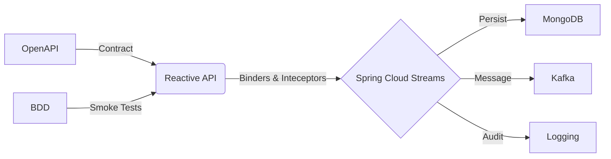

Moved from README due to lack of support for mermaid inline...

```mermaid
graph LR
    A[OpenAPI] -->|Contract| C(Reactive API)
    B[BDD] --> |Smoke Tests| C(Reactive API)
    C --> | Binders & Inteceptors | D{Spring Cloud Streams }
    D -->|Persist| E[MongoDB]
    D -->|Message| F[Kafka]
    D -->|Audit| G[Logging]
```

p.s. Gitlab supports!!!!