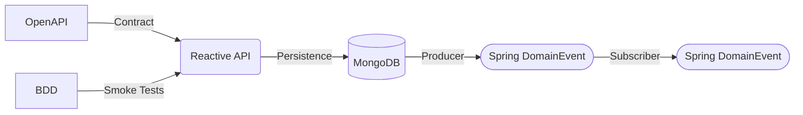

```diff
- This is a work in progress, if you bave any issues please raise an issue or pull request
```

# Reactive Application Reference Implementation 



## OpenAPI/BDD/Spring Reactor/MongoDB/Spring Domain Events (and a little magic)

A reference application that shows some real world hacks and tricks needed to make some of the cooler tech work in 
real world situations. As far as the app goes, it's a simple Reactive CRUD application developed using OpenAPI that 
demonstrates how you might use NoSQL DB (MongoDB), spring domain messaging, BDD and a bunch of other useful stuff.

### The Technology

To name a few...

* [Spring Reactor](https://projectreactor.io/) - The core for our reactive microservice
* [OpenAPI Tools](https://github.com/openapitools/openapi-generator) - Bringing our API-First approach to life
* [BDD For All](https://github.com/Accenture/bdd-for-all/) - Enabling our Test-First (or TDD) approach
* [MongoDB](https://www.mongodb.com/) - How we're persisting data
* [Spring Domain Events](https://www.baeldung.com/spring-data-ddd) - Fun way of handling domain events internally or externally
* [Lombok](https://projectlombok.org/) - Write less code
* [Mapstruct](https://mapstruct.org/) - Fast way to map our objects
* [JUnit](https://junit.org/junit5/) - For all those other things we need to test

### Prerequisites

To compile & run, you'll need...

* JDK 11
* Maven
* [MongoDB](https://docs.mongodb.com/guides/server/install/) or if you're me [use brew](https://docs.mongodb.com/manual/tutorial/install-mongodb-on-os-x/)

#### OpenAPI - An API-First Approach

This project utilizes the OpenAPITools generator to create the base of the application.  Based on the OpenAPI 3.0 spec
located in [src/main/resources/openapi.yaml](src/main/resources/openapi.yaml) and a simple configuration in
the [pom.xml](pom.xml) we create...

* All of the DTO models
* The controller, API and delegate classes
* Documentation endpoint

By running

```shell
mvn compile
```

You can see the code generated in **target/generated-sources/**.  This code will handle most of the plumbing, so you can focus on
the implementation.

In this case, all you need to do is create a delegate implementation (see *com.wickedagile.apis.reference.reactoropenapi.api.VendorAPIDelegateImpl*
in the generated sources directory).  The reference implementation can be found at
[src/main/java/com/wickedagile/apis/reference/reactoropenapi/api/PatientAPIDelegateImpl.java](src/main/java/com/wickedagile/apis/reference/reactoropenapi/api/VendorAPIDelegateImpl.java).

90% of the plumbing you need is generated by this process.  We do create some domain objects to map these, but in an ideal world these would be generated as well.

To learn more about generation, check out...

* Main plugin - https://github.com/OpenAPITools/openapi-generator/tree/master/modules/openapi-generator-maven-plugin
* Spring specific configuration options - https://openapi-generator.tech/docs/generators/spring/

> You can switch back and forth from a reactive project to standard blocking API's by changing **&lt;reactive&gt;true&lt;/reactive&gt;** to false.
> You will need to change the Delegate implementation when swapping back/forth, though.

#### MongoDB

The default database name is **reactiveOpenAPIMongo**, port **27017** on localhost and isn't password protected.  You can change any of this in the [application.yml](src/main/resources/application.yml).

> Check out our [MongoDB docs](docs/MONGODB.md) for more information on configuration.

For testing, we're using an in-memory version of MongoDB so there's really nothing to do either.

> If you don't want to install MongoDB or use Atlas, you can actually use the in memory version of MongoDB by simply removing 
> &lt;scope&gt;test&lt;/scope&gt; from the de.flapdoodle.embed dependency in the pom file

Because we wanted to hook into change events from the repository to create and broadcast "domain" events, 
we had to hardcode in MongoDB to the app.  This is because we ran into issues with DomainEvents and some of the 
other generic ways of capturing changes.  Mostly due to bugs between Lombok, Spring Data, etc...

This means that if you want to change DB's, you'll need to change...

* [src/main/java/com/wickedagile/apis/reference/reactoropenapi/repository/PatientRepository.java](src/main/java/com/wickedagile/apis/reference/reactoropenapi/repository/PatientRepository.java)
* [src/main/java/com/wickedagile/apis/reference/reactoropenapi/repository/RepositoryListener.java](src/main/java/com/wickedagile/apis/reference/reactoropenapi/repository/RepositoryListener.java)
* and of course the configurations

There's not a lot of code and what is there is pretty generic (and many other Spring Data implementations have). 
In a perfect world, we would have 0 code changes, but the things about using the latest and greatest of each 
means interopability you might have found in older version gets a bit tricky.

#### Events

Out of the box, we're using [Spring Domain Events](https://www.baeldung.com/spring-data-ddd) 
which aren't durable, but don't require configuring something else.

These local events are easy to use and can be published/consumed without explicitly linking our code (e.g. method chaining).  Now these events ARE NOT
durable and if the publisher throws an exception the subscribers will never know :( which means...

> Be smart about using this option.  If you need truly durable change events, would recommend looking at
> the Change Feed options from your cloud providers - almost every provider has these now for every DB (Sql or not)

The simple example of an internal processor is [src/main/java/com/wickedagile/apis/reference/reactoropenapi/event/Auditor.java](src/main/java/com/wickedagile/apis/reference/reactoropenapi/event/Auditor.java)
which literally just logs the messages it receives, and although there are some better [auditing mechanisms](https://medium.com/swlh/data-auditing-with-spring-data-r2dbc-5d428fc94688)
available, the idea was to just showcase one potential use case for why you might want an internal event processor.

If you're interested in expanding to Kafka (or Azure Event Hubs, RabbitMQ, GCP Pub/Sub or AWS Kinesis) 
please check out [docs/MESSAGING.md](docs/MESSAGING.md).  The implementation is based on Spring Cloud 
Streams Binder solution, which makes it easy to switch providers without changing code (just config).

### Running the Application

For running (make sure mongodb is started), just execute...

```shell
mvn clean spring-boot:run
```

If it works, you should be able to go to http://localhost:8080/docs and see the docs for the API's.  The 
"Try It Out" feature will let you experiment with the API's and you can check the log (in [logs/](logs/)) or 
STDOUT to check out the messages firing.

### How it Works

This reference uses a few different techniques to minimize code (and improve quality).


#### Shifting Left

Before a line of code is written, we've included a bunch of quality and security into the project to ensure that 
from the first lines of code written, we are keeping things clean and secure.

* [Checkstyle](https://checkstyle.sourceforge.io/google_style.html) (Google Java Style) - combines aesthetic and coding
  conventions that make code easier to read and merge across the team
* [Maven Enforcer](https://maven.apache.org/enforcer/maven-enforcer-plugin/) - keeps your dependencies clean (e.g.
  duplicates, competing versions, etc...)
* [OWASP Dependency Check](https://jeremylong.github.io/DependencyCheck/dependency-check-maven/index.html) - see what 
  vulnerabilities the libraries you're using have
* [Spotbugs](https://spotbugs.github.io/) - Open source static analysis for Java code combined
  with [Find Security Bugs](https://find-sec-bugs.github.io/) for security audits
  and [fb-contrib](http://fb-contrib.sourceforge.net/) for some auxiliary audits.
* [PMD/CPD](https://pmd.github.io/) - Another static analyzer focused on things like unused variables/imports, 
  empty catch blocks and other bad (or hacky) practices.
* [JaCoCo](https://www.eclemma.org/jacoco/) - Code coverage that looks at our BDD & JUnit reports to make sure we're
  testing our code. Alternative here is [OpenClover](http://openclover.org/), but JaCoCo seems to be the goto in a lot
  of orgs these days (been around longer)

These are all configured in [pom.xml](pom.xml), and although some of these are run during the test phase, you can get 
detailed reporting by...

```shell
mvn clean verify
```

will tell you if there are any errors and...

```shell
mvn clean site
```

Will provide a full report, you can see it by going to `target/site/index.html` in your browser and 
checkout the what's under the "Project Reports" section.

##### Checkstyle

It's recommended you configure you editor to use checkstyle, for rules you don't agree with you can just update 
your [checkstyle-suppressions.xml](checkstyle-suppressions.xml).  Recommendation is to keep this to a minimum, 
though, since the editor plugin will automatically correct most issues.

https://checkstyle.sourceforge.io/google_style.html

##### Maven Enforcer 

This is one of the reasons our *dependencyManagement* in the pom is so big and also why we have exclusions with 
the Spring Webflux depdency.  This doesn't just check our primary dependencies for [collision](https://www.baeldung.com/maven-version-collision), 
it checks their dependencies as well. The potential issues can be negligible from this, but do you really 
want to find out the hard way?

This can lead to a lot of cruft in the pom file, though, and can make upgrading versions a bit messy, so you need to 
be really thoughtful here and decide what works best for your team.

https://maven.apache.org/enforcer/maven-enforcer-plugin/

##### OWASP Dependency Check

Why wait till your Veracode or Blackduck scan is complete to find out you need to change or upgrade a dependency?

To fix the issues, you have two options (well three)...

* Upgrade the lib to a secure version, by adding it to the *dependencyManagement* in the [pom.xml](pom.xml)
* Add it to the excludes (just ignores the problem) [spotbugs-exclude.xml](spotbugs-exclude.xml)
* Find a different (secure) library - not always easy/reccomended

https://jeremylong.github.io/DependencyCheck/dependency-check-maven/index.html

##### Spotbugs & PMD/CPD

Why waste time on catching things in your manual code reviews, these, combined with some other plugins will pretty 
much guarantee a pass from analyzers like Sonarqube and in combination with the other plugins will have you 
some pretty clean code in your pull requests.

> For those that you just don't want to deal with, [spotbugs-exclude.xml](spotbugs-exclude.xml) is there to override.

https://spotbugs.github.io/ & https://pmd.github.io/

##### JaCoCo

Wonder how much of your code is being tested?  If you're doing BDD/TDD right this should be a no brainer.  
I'm a strong believer in functional testing over unit and if done right, your code coverage should be right, 
since functional tests should flex the muscle of most of your code.  If it's not, two things...

* You've written code you didn't need to
* Your missing some test cases

To see the report, you have two options...

1. `mvn site` will give you the full set of reports, you just need to open up [target/site/project-reports.html](target/site/project-reports.html)
2. `mvn test jacoco:report` will generate the stand alone report in [target/site/jacoco/index.html](target/site/jacoco/index.html)

#### Test-first

For our tests we use a BDD style (Gherkin) approach with [BDD For All](https://github.com/Accenture/bdd-for-all).  
Focused on some positive and negative smoke tests, we make sure that our application is functioning as expected 
before we write a line of code.  This is done quite simply by...

1. Creating a test runner [src/test/java/RunCucumberTests.java](src/test/java/RunCucumberTests.java) responsible for starting up the spring app and executing the feature files
2. Then you'll need add some configuration [src/test/resources/application.yml](src/test/resources/application.yml), this will be pretty much be the same for most implementations.  It sets the server/port, but you can do a lot in this.
3. Finally, you'll need one or more feature files.  These are currently found in [src/test/resources/features](src/test/resources/features)

After running tests, you can see the full report in [target/cucumber/cucumber-html-reports/overview-features.html](target/cucumber/cucumber-html-reports/overview-features.html)

##### Creative Component Testing

In addition to executing the functional tests, we also "hook" into the eventing framework to see if we're generating 
the number of events we'd expect from all these CRUD requests.  This is done via the [src/test/java/com/wickedagile/apis/reference/reactoropenapi/event/EventsConfig.java](src/test/java/com/wickedagile/apis/reference/reactoropenapi/event/EventsConfig.java) 
class.  We simply collect the events (and their types) and match them against an expected output.

This allows us to write a lot less test code, but test important functionality as part of our functional tests since 
we're still trying to figure out how BDD and Event Driven Architectures can place nicely.

Recommend reviewing the user guide - https://github.com/Accenture/bdd-for-all/blob/develop/docs/USERGUIDE.md - as BDD For All can do a lot 
and to put in perspective, the better your BDD tests are, the better your code coverage will be, which means less Unit tests (Yay!).

## Some More Background

There's a lot happening in here, so want to make sure I cover some more features...

#### Reactive Data Repositories

You can't be a true reactive (or streaming) application if you block.  One of the hardest part of designing transactional 
systems in a "reactive" environment is that you have to deal with data sources.

Datastores traditionally were designed to block (e.g. request -> wait <- respond), but between a multitude of vendors 
(including our friends @ [MongoDB](https://www.mongodb.com/)) and Spring, they've made this pretty easy to do and 
since there are better writers than me documenting this stuff, and really "reactive repositories" are just
[JPA](https://spring.io/projects/spring-data-jpa) on steroids.

> Need more detail on reactive repositories?  Go visit https://www.baeldung.com/spring-data-mongodb-reactive.

All that aside, I will mention here that we made our code specific to Mongo with two classes, something I didn't 
want to do, but had to even though the code is pretty easy to tweak.  These classes are...

* [src/main/java/com/wickedagile/apis/reference/reactoropenapi/repository/VendorRepository.java](src/main/java/com/wickedagile/apis/reference/reactoropenapi/repository/VendorRepository.java) - A simple spring repo
* [src/main/java/com/wickedagile/apis/reference/reactoropenapi/repository/RepositoryListener.java](src/main/java/com/wickedagile/apis/reference/reactoropenapi/repository/RepositoryListener.java) - Our change event listener

Now, in a perfect world we would have used a [generic type](https://docs.spring.io/spring-data/commons/docs/current/api/org/springframework/data/repository/reactive/package-summary.html), which would 
allow us to switch between DB's easily with just configuration changes.  But the world isn't perfect and we needed 
to make this work.  To this end, we used the Vendor specific implementations so we could capture the 
change (insert/update/delete/view) events.  Check out the comments in RepositoryListener for more on why.

> Final word - Don't ever block a Mono or Flux, a lot of first timers try to work with these objects like they're
> normal Java POJO's.  They're not.  Do some homework before attempting at home!

#### Centralized Exception Handling

Now the folks at [Baeldung might disagree](https://www.baeldung.com/exception-handling-for-rest-with-spring) with our approach, 
but when building enterprise software, centralizing anything is usually super helpful.   It's for this reason 
we used the @ControllerAdvice option for error handling.

You can check out [src/main/java/com/wickedagile/apis/reference/reactoropenapi/domain/exception/InvalidEntityHandler.java](src/main/java/com/wickedagile/apis/reference/reactoropenapi/domain/exception/InvalidEntityHandler.java) 
for more detail, but it's really simple...

```java

import org.springframework.web.bind.annotation.ControllerAdvice;
import org.springframework.web.bind.annotation.ExceptionHandler;

@ControllerAdvice
public class MyExceptionHandler {

  @ExceptionHandler(IllegalArgumentException.class)
  public ResponseEntity myHandlerMethod(IllegalArgumentException ex) {
    return ResponseEntity.status(HttpStatus.NOT_FOUND)
            .contentType(MediaType.APPLICATION_JSON)
            .body(Arrays.asList(errorMapper.argErrorToError(ex).code(INVALID_PAYLOAD)));
  }
  
}

```

The important parts of the code are the annotations.  First, we have @ControllerAdvice, and this just tells 
Spring that we may have some code to execute should certain situations arise (e.g. exception).

The next annotation is the @ExceptionHandler one, and for this we provide an exception (e.g. IllegalArgumentException).  
All this does is tell Spring that any time an IllegalArgumentException is thrown by any controller, catch it 
and do this.

Now the argument to use something like ResponseStatusException is that you can standardize the exception response 
and provide engineers more control over the handling itself.  I find in most cases this is theory, not the reality. 
The security of ensuring your capturing exceptions from everywhere vs leaving it up to someone who is in a rush 
to deliver a feature, seems like a bigger problem.

##  The End Goal

I don't necessarily believe that reference implementations like this work well if you're just trying to pull 
code to get something to work or fork and try to modify for your own API spec.  My overall goal is to turn this 
into a Maven Archetype before Spring deprecates the code :)

If you want to help, ping me.