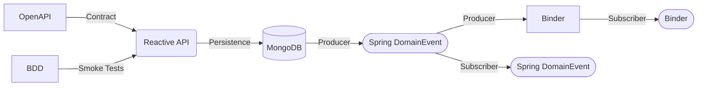

## Event Driven Architecture (Messaging and More...)



As an engineer, there are some concepts that just make sense to me.  Event Driven Architecture (EDA) is one of those things. 

I want to get into the coding piece here, so I'm going explain why with links...

* What is it? https://en.wikipedia.org/wiki/Event-driven_architecture
* Why do it? https://siliconangle.com/2018/12/27/want-software-first-agility-get-event-driven-architecture-says-accenture-reinvent/

And to make things even better (and unlike the MongoDB implementation we chose), 
you can easily switch out your underlying messaging platform without a code change. Normally this would be done by changing the binders registered in [pom.xml](pom.xml) and settings in 
[src/main/resources/application.yml](src/main/resources/application.yml), but we've simplified 
this even more by showing a good use case for using Spring Profiles.

In order to switch messaging provider implementations, it's two easy steps...

1. Set an active profile in Spring by adding one of the following in application.yml
  ```yaml
  spring:
    profiles: XXXXXX
  ```
2. Update the corresponding configuration for that implementation

Possible implementations are...

* [KAFKA](KAFKA.md)
* [AWS](AWS.md)
* [AZURE](AZURE.md)
* GCP (COMING SOON)
* RABBITMQ (COMING SOON)

> Reccomend you spend some time reading more on our choice of implementation
> [spring cloud stream binders](https://spring.io/blog/2020/07/13/introducing-java-functions-for-spring-cloud-stream-applications-part-0)
> which provides us a lot of flexibility, but also forced us to create
> a custom implementation [src/main/java/com/wickedagile/apis/reference/reactoropenapi/event/exception/BinderExceptionHandler.java](src/main/java/com/wickedagile/apis/reference/reactoropenapi/event/exception/BinderExceptionHandler.java) 
> since Spring has deprecated many of the convenience methods helpers like [EmitterProcessor](https://projectreactor.io/docs/core/release/api/reactor/core/publisher/EmitterProcessor.html)

**NOTE:** There are a bunch of binder implementations, from RabbitMQ to Azure Event Hubs. Check out the [configuration page on messaging](docs/MESSAGING.md) for examples of connecting to these instead.

Also, just to prove messages are going (a little tougher to see in something like Kinesis), we have a simple consumer
[src/main/java/com/wickedagile/apis/reference/reactoropenapi/event/BinderConsumer.java](src/main/java/com/wickedagile/apis/reference/reactoropenapi/event/BinderConsumer.java)
check it out if you're curious.  Really simple to grasp (e.g. function name in application.yml matches function name in
class).